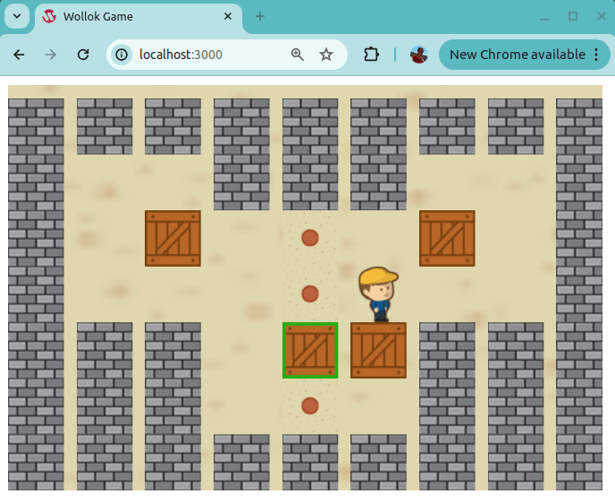

# Sokoban
 

Ejemplo del juego Sokoban hecho con Wollok-Game. El personaje principal puede moverse hacia arriba, abajo, derecha o izquierda. Si tiene una caja puede moverla si avanzando la caja tiene un lugar libre (no tiene un lugar libre si hay otra caja o la pared).

